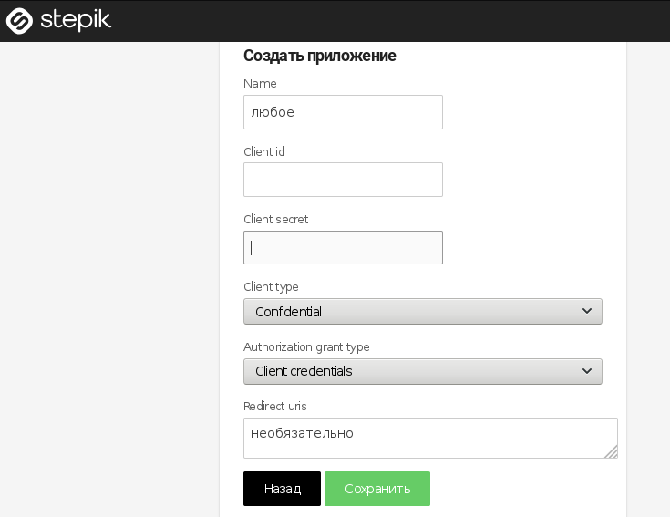
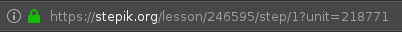

После согласования формата - добавить описание

# Как настроить выгрузку на stepik?
1. Для начала необходимо зарегистрировать приложение:
   - Нужно перейти по [ссылке](https://stepik.org/oauth2/applications/)
   - Заполняем любое имя, и **обязательно** выбираем 
       - client type - *confidential*
       - authorization grant type - *client credentials* 
       
2. Lesson ID можно найти в ссылке урока 
3. На [странице](http://vi-info.herokuapp.com/stepik-upload) заполняем предыдущие поля, и либо загружаем необходимый json-файл, либо ставим галочку, что используем предыдущий файл (*пока не работает*)
P.S. пока лучше использовать пустые уроки - возможно, что выгружаемые задачи перезапишут остальные шаги. Скоро исправим.